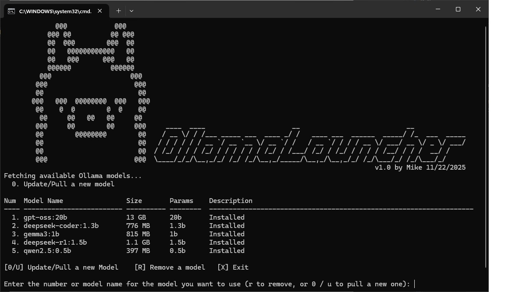
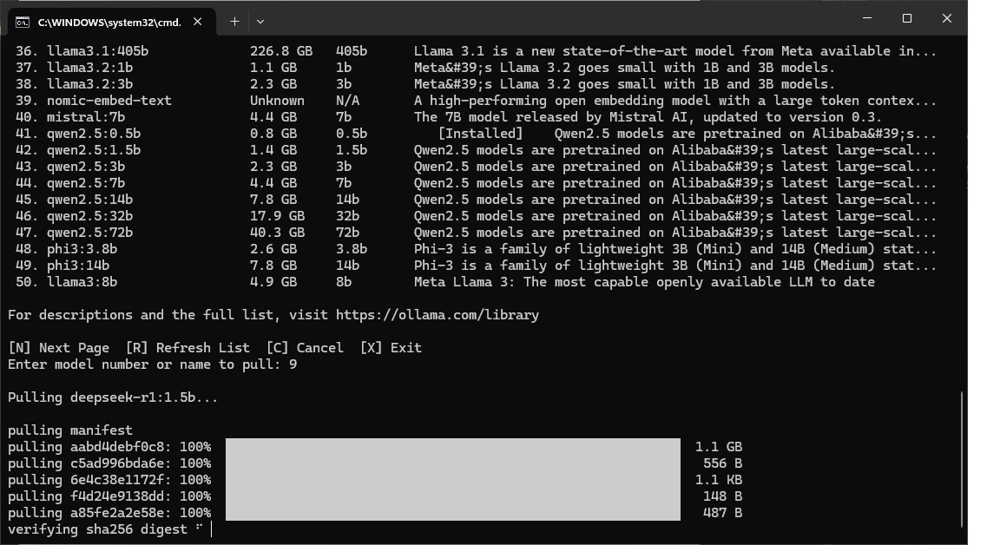

# ollamaLauncher.bat

#### Launcher Main Menu


#### Example: Pulling a Model


CLI tool for [Ollama](https://ollama.ai) on Windows.

## Features
- **Interactive Model Management**:
  - **List & Launch**: View installed models with details (Size, Params) and launch them instantly.
  - **Fetch & Download**: Browse the top 100+ models from the [Ollama Library](https://ollama.com/library) directly within the CLI.
  - **Search / re-order Models**: Search or order models listed.
  - **Remove Models**: Easily delete installed models to free up space.
- **Smart Caching**: Caches the online model list for 1 hour to speed up browsing.
- **Detailed Views**: Displays model size, parameter count, and descriptions in a clean table format.
- **Auto-Setup**: Detects if Ollama is missing and offers to download the installer.

## Requirements
- **OS**: Windows (Only tested so far on Windows 10 & 11)
- **Dependencies**:
  - [Ollama](https://ollama.ai) (`ollamaLauncher.bat` will download & help you install it if missing)
  - PowerShell (Standard on Windows)
  - Internet connection (for fetching new models)

## Installation
1. Download the launcher folder, including `ollamaLauncher.bat`, `fetch_models.ps1`, `config/`, and `src/`.
2. Double-click `ollamaLauncher.bat` to run.
*Note: The launcher runs helper scripts from its own folder. It may refresh a legacy copy in `%APPDATA%\ollamaLauncher`, but it does not delete the local files.*
3. If Ollama is not installed CLI will download it using curl then the install file will need to be manually installed by the user.
4. Once Ollama is installed you can close the Ollama GUI chat and press any key in CLI to continue  or re-launch the script ollamaLauncher.bat

## Associated Files:
- ollamaLauncher.bat : Main launcher batch file script, run this to use the program.
- fetch_models.ps1 : PowerShell script to fetch model lists.
- config/repos.default.json : Default repository definitions used to create `%APPDATA%\ollamaLauncher\repos.json`.
- src/OllamaLauncher/Paths.psm1 : Shared path resolver for config and cache locations.
- %APPDATA%\ollamaLauncher : User config and state files.
- %LOCALAPPDATA%\ollamaLauncher\Cache : Generated cache and selector result files.

## Usage
### Main Menu
When you launch the script, you'll see your installed models:
```
Fetching available Ollama models...
Num  Model Name                Size       Params    Description
---- ------------------------- ---------- --------  -----------------------------------------------------
  1. llama3:latest             4.7 GB     8b        Installed
  2. mistral:latest            4.1 GB     7b        Installed
  3. neural-chat:latest        4.1 GB     7b        Installed

[0/U] Update/Pull a new Model    [R] Remove a model   [X] Exit

Enter the number or model name for the model you want to use (r to remove, or 0 / u to pull a new one):

### Browsing Online Models (Option 0)
Select `0` to browse the Ollama library. The list is paginated (50 per page).

Fetching latest top 100 models from Ollama.com...
Successfully fetched 100 models.

Using cached model list, enter [R] to re-pull and refresh.

Select a model to download from the Ollama library.

Showing Models (Page 1/2)

Num  Model Name                Size (GB)  Params    Description
---- ------------------------- ---------- --------  -----------------------------------------------------
  1. llama3:8b                 4.7 GB     8b        The most capable openly available LLM to date
  2. llama3:70b                40.0 GB    70b       The most capable openly available LLM to date
  3. mistral:7b                4.1 GB     7b        The 7B model released by Mistral AI, updated to v0.3
  4. gemma:2b                  1.7 GB     2b        Gemma is a family of lightweight, state-of-the-art...
  5. gemma:7b                  5.0 GB     7b        Gemma is a family of lightweight, state-of-the-art...
  ...
 48. starcoder2:3b             1.7 GB     3b        The next generation of transparently trained open ...
 49. starcoder2:7b             4.1 GB     7b        The next generation of transparently trained open ...
 50. starcoder2:15b            9.1 GB     15b       The next generation of transparently trained open ...

For descriptions and the full list, visit https://ollama.com/library

[N] Next Page  [R] Refresh List  [C] Cancel  [X] Exit
Enter model number or name to pull:
```

## Troubleshooting
- **"ollama command not found"**: The script will offer to download the installer for you.
- **"Critical file 'fetch_models.ps1' is missing"**: Ensure `fetch_models.ps1` is in the same directory as `ollamaLauncher.bat` or already exists in `%APPDATA%\ollamaLauncher`. The launcher requires `fetch_models.ps1` to function properly.
- **"Default repository config is missing"**: Ensure `config/repos.default.json` is present in the launcher folder.
- **"Failed to fetch models"**: Check your internet connection. The script tries to scrape `ollama.com/search`.
- **Cache Issues**: If the online list seems outdated, use the `[R]` option in the fetch menu to force a refresh.
- **`[V] View Models` missing for HuggingFace**: Tag/variant scraping is config-driven via a per-repo `tagFetch` block in `%APPDATA%\ollamaLauncher\repos.json`. If you upgraded from an older release, delete that file (or merge the new `tagFetch` blocks from defaults) and re-run the launcher to regenerate it.

## Author
Mike

## License
This project is open source and available under the MIT License.

## References
- [Ollama Official Website](https://ollama.ai)
- [Ollama GitHub Repository](https://github.com/jmorganca/ollama)
